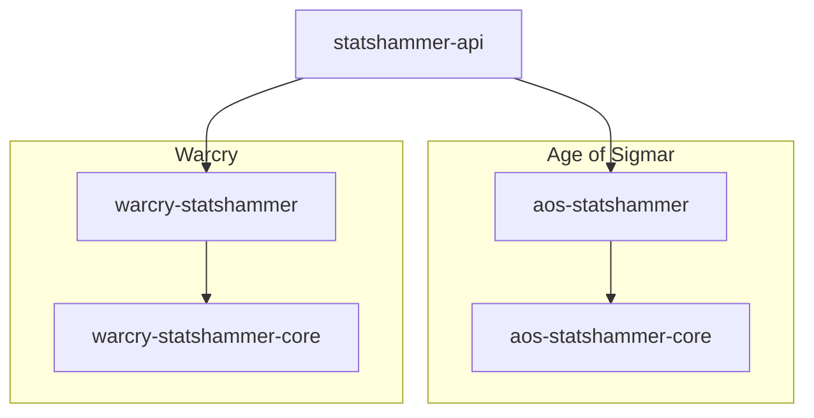
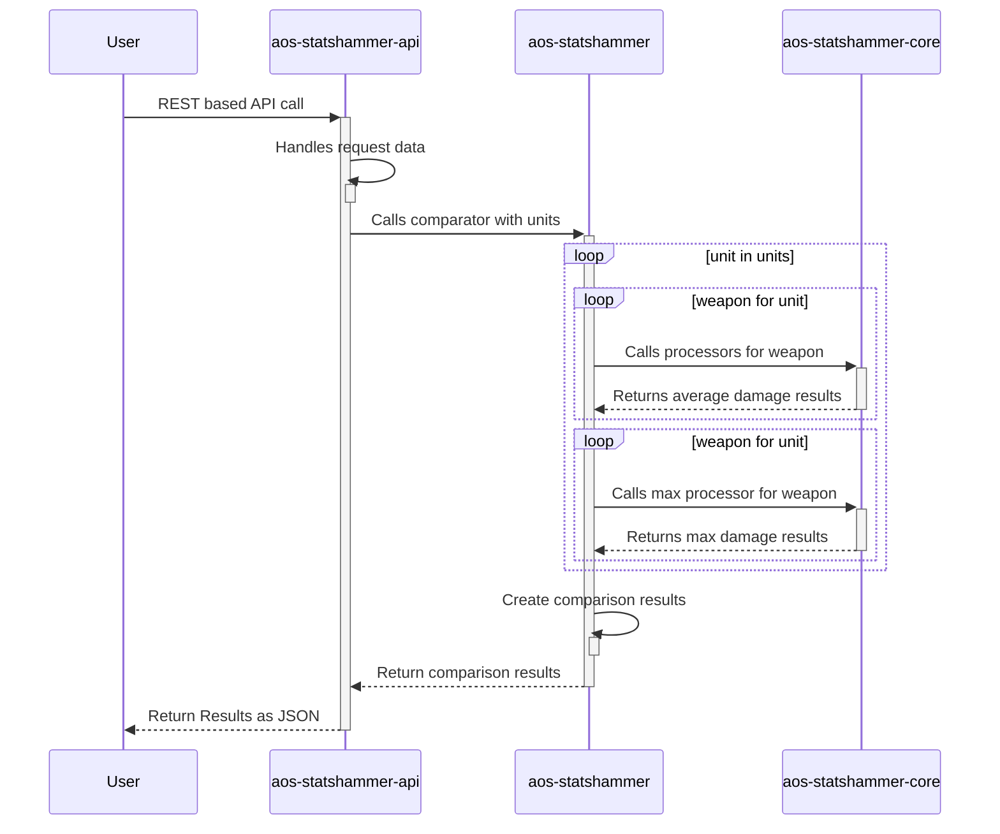

# Statshammer API

Contains the REST API and core logic for calculating statistical damage outputs for various Warhammer products (sometimes also referred to as Mathhammer).

## Supported Games

- Age of Sigmar
- Warcry _[coming soon]_

## Related Projects

- [AoS Statshammer](https://github.com/damonhook/aos-statshammer)
  - React based frontend for interacting with the calculated statistics for Warhammer Age of Sigmar units.
- [Warcry Statshammer](https://github.com/damonhook/warcry-statshammer)
  - React based frontend for interacting with the calculated statistics for Warhammer Warcry fighters.

## Crates

This project is organised into smaller `crates` to handle specific parts of the process, following a 3 layer design of _"Interface > Aggregate > Calculate"_.

- `statshammer-api` _[coming soon]_
  - Contains the REST based API for calculating the damage statistics for the supported games. This is a very light interface layer, with the logic being called from `aos-statshammer` and `warcry-statshammer` crates.
- `aos-statshammer`
  - Contains the aggregation logic for comparing the statistics for multiple Age of Sigmar units (using calculations performed by `aos-statshammer-core`).
- `aos-statshammer-core`
  - Contains the core logic for calculating the various statistics for a specific Age of Sigmar weapon (and associated abilities).
- `warcry-statshammer`
  - Contains the aggregation logic for comparing the statistics for multiple Warcry fighters (using calculations performed by `warcrys-statshammer-core`).
- `warcry-statshammer-core` _[coming soon]_
  - Contains the core logic for calculating the various statistics for a specific Warcry weapon.

### Architecture

### Example Flow

This is an **extremely simplified** example flow to illustrate how the pieces fit together.

## Disclaimer

This tool is in no way endorsed or sanctioned by Games Workshop - it is unnoffical and fan-made.
